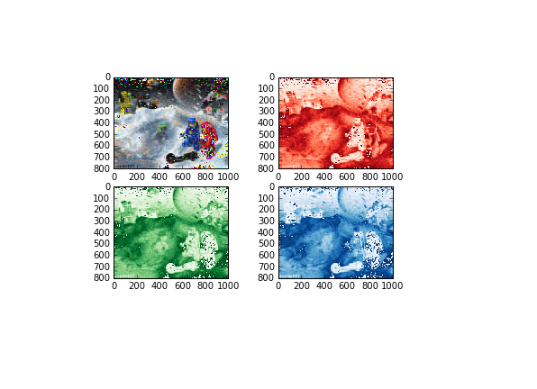
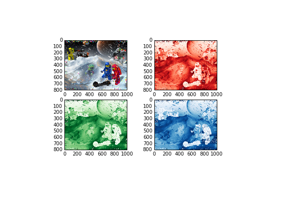

UECM3033 Assignment #2 Report
========================================================

- Prepared by: ** Vignesh a/l Nagarajah**
- Tutorial Group: T3

--------------------------------------------------------

## Task 1 --  $LU$ Factorization or SOR method

The reports, codes and supporting documents are to be uploaded to Github at: 

[https://github.com/vigneshnagarajah/UECM3033_assign1](https://github.com/your_github_id/UECM3033_assign1)

Explain your selection criteria here.
LU decomposition method is based on the actual factorisation of the matrix describing the whole system of
linear equations.The matrix is fortunately sparse,which means most of its elements are zeros.
The method pre-transforms the matrix into two triangular matrices which can be then repeatedly used
to directly obtain the solution vector from the right hand side vector.
Despite its optimizations it is still very demanding in terms of computational resources and on the
common computer architecture (32-bit memory addressing) it is very difficult to solve 2D grids larger
than approximately 900 × 900 grid nodes.SOR method is simple and straight-forward method is often the first choice for the Poisson equation solver.It is based on the Gauss-Seidel method, which is modified by adding a parameter ω acccelerating the convergence. The choice of ω is essential for the good performance of the method. Our results were obtained using the Chebyshev acceleration.SOR is significantly faster, however the solution is less smooth and thus unsuitable for the multigrid method.
I make the condition fixed to np.count_nonzero(A) > 1/2*len(A). Sparse matrix is a matrix consists of zero element mostly, hence, if the nonzeros is greater that half of the length of matrix A then I will choose LU method.Furthermore since both coefficient matrix cannot perform Cholesky decomposition, hence they are not positive definite, so we cannot use SOR method to solve the problem.

Explain how you implement your `task1.py` here.

For this task 1 , self define function of lu, sor and solve are created. For LU method, two matrix will be created with is the lower matrix and upper matrix whereby A=LU, thus Ax=LUx=b, so will be define into Ly=b and Ux= y. So, we can get the x matrix after getting the y matrix.As for the SOR method, omega is assume to be 1.77 which is within the range of 1 and between 2 and that will converge for any initial vector if A matrix is symmetric and positive definite. If omega is greater than 2 , SOR method will diverge. If 0 < omega<1, SOR method converges but the convergence rate is slower than the Gauss-Seidal method. Then, the iteration limit also needed to be set so that it will not loop until infinity time. In this task, the iteration limit is assumed to be 10. We start the iteration by assuming the first x is a zero vector. Then we will substitute each x we found to count the new x and iterate until the iteration limit.In order to find the exact answer, let sol equal to np.linalg.solve(A,b) else the answer will not be true.

---------------------------------------------------------

## Task 2 -- SVD method and image compression

Put here your picture file (Image.jpg)

How many non zero element in $\Sigma$?
There are 800 non zero element each for the blue,green and red colour

Put here your lower and better resolution pictures. 

When the resolution is lower , $\Sigma_{30}$

When the resolution is better, $\Sigma_{200}$

Explain how you generate
these pictures from `task2.py`.

This figures show when the $\Sigma$ is keeping the first 30 and 200 non zero elements. In order to generate the pictures, firstly, push the new "Image" by using github.Then, the image is needed to be read in order to get the 3 matrices which is the r,g and b. Each of the r,g and b is a 3 dimension matrix. In order to find the U,$\Sigma$ and V of the three matrices which named as Ur,Sr and Vr for the red matrix, Ug,Sg,Vg for the green matrix and Ub,Sb,Vb for the blue matrix, scipy.linalg.svd is used. Then, the image is plotted by using "plt.figure". After that, to find the non zero elements in $\Sigma$, numpy.count_nonzero can be used. Next, image is needed to be compressed by keeping the first 30 non zero elements as in $\Sigma$ and set all other non zero elements to zero. This will construct a lower resolution matrix.A self define function is created for this purpose. Firstly, a copy of the original $\Sigma$ to avoid loss of information by using Sr.copy and same goes to blue and green. Then only start to keep the first n non zero elements and set others to zero by using Sr1[n:800]=np.zeros_like(Sr[n:800]). Then, the Sr1 is needed to be change to dimension (800x1000) which is originally (800,1) by using sp.linalg.diagsvd so that no dimensional error will occur when combine it to a matrix of U,$\Sigma$,V by dot multiplication. So, a new matrix is created by the dot multiplication of np.dot. Then, all the process is repeated by green and blue matrices. After all this, another figure is plotted which shows a lower resolution. In part 4, a new better resolution can be plotted by calling the self define function again.

What is a sparse matrix?
A sparse matrix is a matrix in which most of the elements are zero. By contrast, if most of the elements are nonzero, then the matrix is considered dense. The fraction of non-zero elements over the total number of elements (i.e., that can fit into the matrix, say a matrix of dimension of m x n can accommodate m x n total number of elements) in a matrix is called the sparsity (density)

-----------------------------------

last modified: change your date here<11 March 2016>
